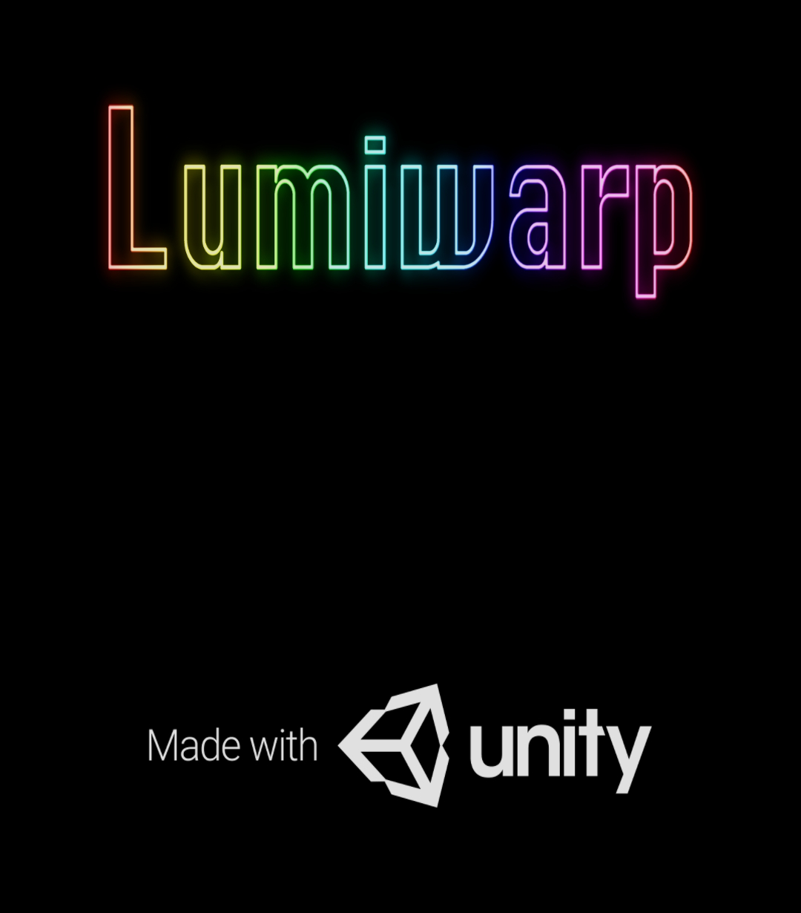
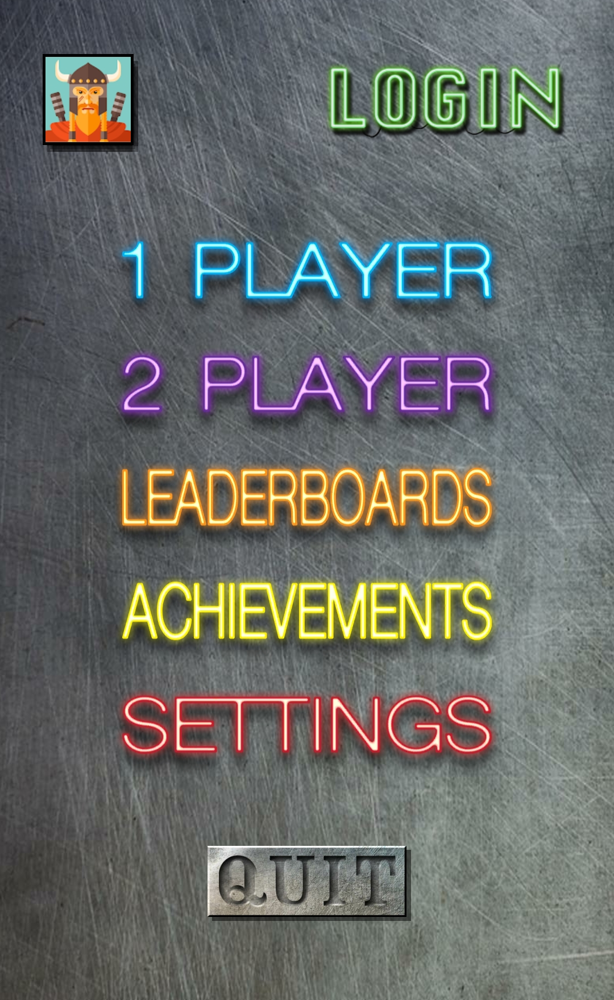
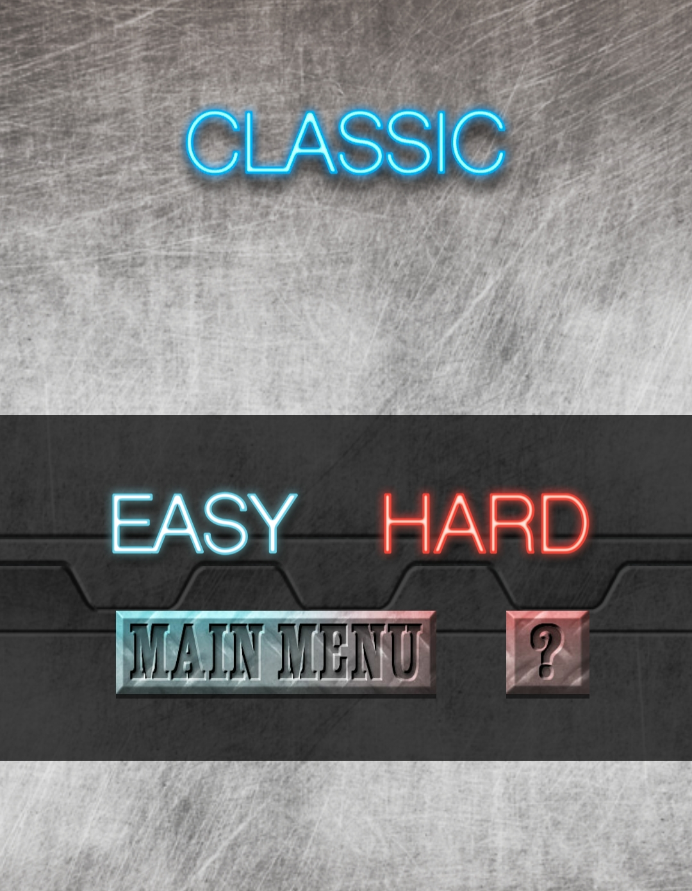
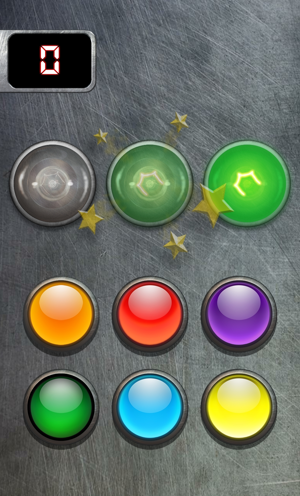
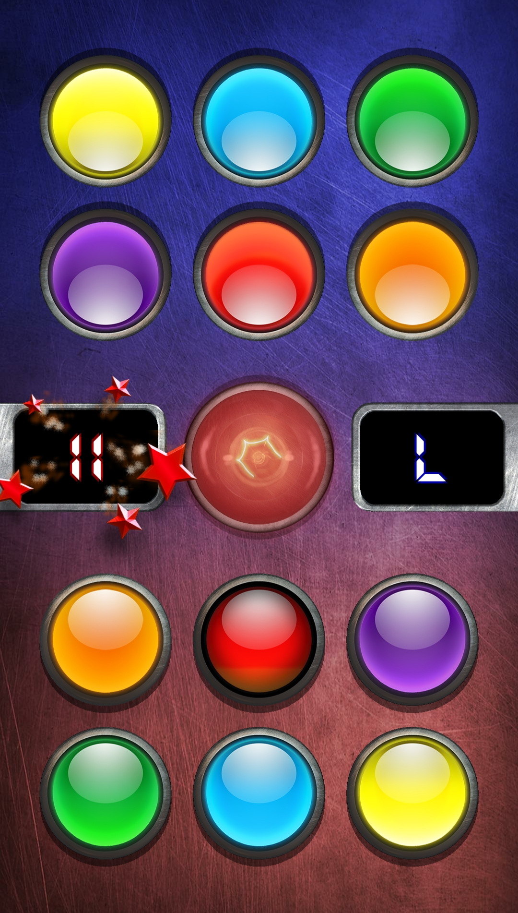
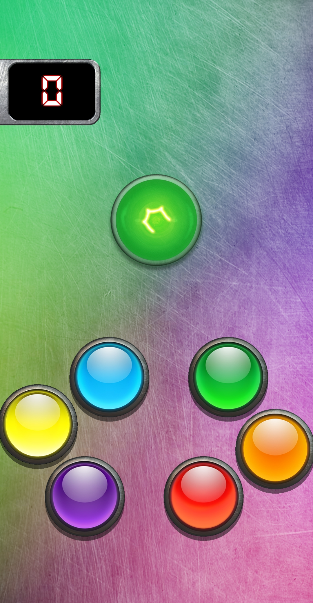
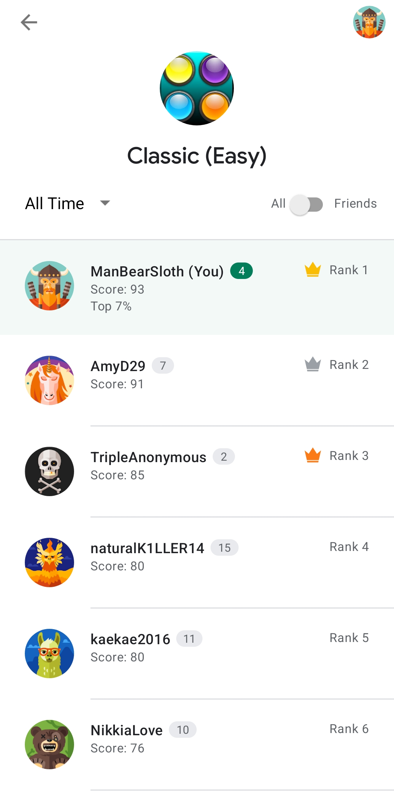
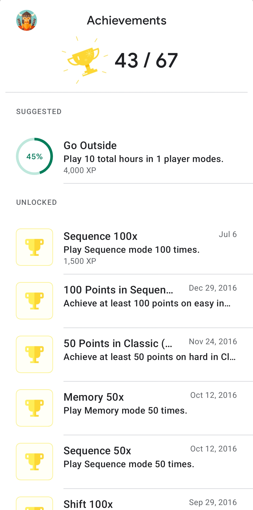

# Lumiwarp
Lumiwarp is a game published to Google Play that I made that was inspired by a childhood toy I had called Brain Warp. But in my game, instead of have a physical ball that you have to turn the right colored side up, you just have to mash the right button that corresponds to the light shown.
 
It can be downloaded for free here:
https://play.google.com/store/apps/details?id=com.ArachnoidEntertainment.Lumiwarp

 

There are various modes of 1 to 2 players with alternate difficulties that change up the gameplay for a fresh experience.

 

Some game types change the amount of lights, some move the buttons on you, and with 2-player modes, the first to hit the button wins the point.

   

There are even leaderboards and achievements that use Google Play's integrated systems.

 

